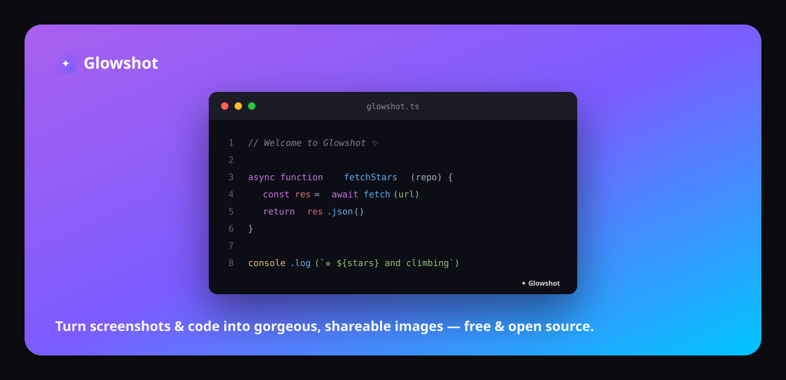

<div align="center">



<h1>✦ Glowshot</h1>

**Turn boring screenshots and code snippets into gorgeous, shareable images — in seconds.**

Free · open source · runs 100% in your browser · no signup, no upload, no tracking.

[](https://github.com/harinazrekar/glowshot/stargazers)
[](./LICENSE)
[](https://nextjs.org)
[](./CONTRIBUTING.md)

[**🚀 Live demo**](https://glowshot-sigma.vercel.app) · [Report bug](https://github.com/harinazrekar/glowshot/issues) · [Request feature](https://github.com/harinazrekar/glowshot/issues)

</div>

---

## Why Glowshot?

Ever posted a plain grey screenshot and watched it get ignored? Beautiful visuals get far more engagement. Glowshot wraps your screenshots and code in tasteful gradients, device frames, and soft shadows so every image you share looks like it came from a design team — without opening Figma.

It's a free, open-source alternative to tools like **ray.so**, **carbon**, and **screenshot.rocks**, with a few things they don't have: mesh gradients, one export for both images *and* code, retina output, and zero backend (your files never leave your machine).

## ✨ Features

- 🖊️ **Annotations** — **freehand pen, arrows, lines, boxes, ellipses, highlights, text, numbered steps, spotlight, and real pixelation** (hide API keys & secrets before you post). Select, move, resize, delete, recolor, **duplicate** (`⌘D`), reorder (`[` / `]`), nudge (arrow keys), with full **undo/redo**.
- 🔢 **Numbered step callouts & spotlight** — auto-numbered badges for tutorials, plus a focus tool that dims everything except the region you're highlighting.
- 🔳 **True pixelate/redact** — samples the actual pixels beneath it (canvas-based) so the blur is baked into the exported image, refreshed at the moment of export for pixel-perfect accuracy.
- 🎨 **Stunning backgrounds** — 18 hand-tuned gradients, 8 mesh gradients, solids, custom colors, transparent, or your **own uploaded image** — plus a **Randomize** button.
- 🖼️ **Screenshots & code, one tool** — drop an image *or* paste code with real [Shiki](https://shiki.style) syntax highlighting (VS Code themes), adjustable font size, and tab-to-indent.
- 🪟 **Window frames** — macOS traffic lights or a browser chrome, in light and dark.
- 🧊 **3D tilt & effects** — perspective tilt, film-grain noise, and frame borders for that premium look.
- 🌈 **Full control** — padding, corner radius, six shadow depths, and aspect-ratio presets (1:1, 16:9, X/Twitter, story…).
- ⭐ **One-click preset looks** — Clean, Punchy, 3D Tilt, Neon — a whole coordinated style in a tap.
- ⚡ **Instant export** — copy to clipboard or download crisp **2× / 3× retina** **PNG, JPEG, or scalable SVG**, plus **copy as a data-URI** to paste straight into Markdown/CSS/``. `⌘S` to export, `⌘⇧C` to copy.
- ⌨️ **Keyboard-first** — tool hotkeys (V/P/A/L/R/O/H/T/N/F/B), undo/redo, duplicate, reorder, nudge, and a built-in shortcuts cheatsheet (`?`).
- 💾 **Remembers your style** — your look persists across reloads (nothing leaves your browser).
- 📋 **Paste anywhere** — paste an image from your clipboard and it just appears.
- 🔒 **Private by design** — 100% client-side. No account, no upload, no analytics. Self-host it in one command.
- 🧑‍💻 **Language auto-detect** — paste code and Glowshot guesses the language for you.

## 🚀 Quick start

```bash
git clone https://github.com/harinazrekar/glowshot.git
cd glowshot
npm install
npm run dev
```

Open [http://localhost:3000](http://localhost:3000) and start making things glow.

## 🏗️ Build & self-host

Glowshot is a Next.js app that renders your content entirely on the client, so you can host it **anywhere** for free.

```bash
npm run build   # production build
npm start       # serve it
```

Deploy to Vercel, Netlify, or Cloudflare Pages with zero config:

[](https://vercel.com/new/clone?repository-url=https://github.com/harinazrekar/glowshot)

## 🛠️ Tech stack

| | |
|---|---|
| **Framework** | [Next.js 16](https://nextjs.org) (App Router) + [React 19](https://react.dev) |
| **Styling** | [Tailwind CSS v4](https://tailwindcss.com) |
| **Syntax highlighting** | [Shiki](https://shiki.style) |
| **Image export** | [html-to-image](https://github.com/bubkoo/html-to-image) |
| **State** | [Zustand](https://github.com/pmndrs/zustand) |
| **Icons** | [Lucide](https://lucide.dev) |

No database. No API. No server-side rendering of your content. Just a fast, pretty tool.

## 🗺️ Roadmap

- [x] Annotations (freehand pen, arrows, lines, boxes, ellipses, highlight, text)
- [x] Numbered step callouts + spotlight / focus
- [x] Real canvas-based pixelate / redact (exports correctly)
- [x] Duplicate, reorder, nudge + full keyboard control
- [x] Custom background image upload + randomize
- [x] 3D tilt, film grain, borders, preset looks
- [x] PNG / JPEG export, adjustable code font size
- [x] Export to scalable SVG & copy as data-URI
- [x] Undo/redo + persisted settings
- [ ] Multi-window / stacked screenshots
- [ ] Shareable preset links
- [ ] Browser extension (screenshot → beautify in one click)

Have an idea? [Open an issue](https://github.com/harinazrekar/glowshot/issues) — this project is built in the open.

## 🤝 Contributing

Contributions make the open-source world go round. Whether it's a new gradient, a bug fix, or a whole feature — you're welcome here. Read [CONTRIBUTING.md](./CONTRIBUTING.md) to get started.

If Glowshot saved you time, the best thank-you is a **⭐ star** — it genuinely helps others find it.

## 📄 License

[MIT](./LICENSE) — do anything you want, just keep the notice.

---

<div align="center">

Built with 💜 by <a href="https://deviaisolutions.vercel.app">Devia Solutions</a> · <a href="https://glowshot-sigma.vercel.app">glowshot-sigma.vercel.app</a>

<sub>If you build products this polished, <a href="https://deviaisolutions.vercel.app">let's talk</a>.</sub>

</div>
